# Orbita — Architecture Overview & Evaluation

> Brainstorming document — honest, unfiltered observations about structure, dependencies, and code quality.
> Last updated: 2026-06-07

---

## 1. ASCII Architecture Diagram

```
┌──────────────────────────────────────────────────────────────────────────────┐
│                              BROWSER                                          │
│  ┌─────────────────────────────────────────────────────────────────────────┐ │
│  │                         main.tsx (Entry)                                 │ │
│  │  Providers: QueryClient → Mantine → Notifications → Router → Modals     │ │
│  │  Global:  dayjs locale setup, Mantine CSS imports, React StrictMode     │ │
│  └──────────────────────────────┬──────────────────────────────────────────┘ │
│                                 │                                             │
│  ┌──────────────────────────────▼──────────────────────────────────────────┐ │
│  │                          App.tsx (Root)                                  │ │
│  │  ┌─────────────────────┐    ┌──────────────────────────────────────┐    │ │
│  │  │  Auth gate          │    │  AppShell (Mantine layout)            │    │ │
│  │  │  !isAuth → AuthPage │    │  ┌─────────────┐ ┌────────────────┐  │    │ │
│  │  │  isAuth → AppShell  │    │  │  Navbar     │ │ <Routes>       │  │    │ │
│  │  └─────────────────────┘    │  │  (App/)     │ │  Lazy-loaded   │  │    │ │
│  │                              │  │             │ │  pages         │  │    │ │
│  │                              │  └─────────────┘ └────────────────┘  │    │ │
│  └──────────────────────────────┴───────────────────────────────────────┘    │ │
│                                                                               │
│  ┌─── PAGES (lazy-loaded route components) ───────────────────────────────┐  │
│  │                                                                          │  │
│  │  Auth      Home      OrgOverview   ProjectOverview   Board              │  │
│  │  (eager)   Dashboard Org/:id       Projects/:id      Boards/:id         │  │
│  │            (stub)    OrgSettings   ProjectSettings   BoardSettings      │  │
│  │                                                                          │  │
│  │  Calendar  Search    DocumentView  Settings          NotFound           │  │
│  │  (wired)   (stub)    Documents/:id /settings         (404)              │  │
│  └──────────────────────────────────────────────────────────────────────────┘  │
│                                                                               │
│  ┌─── COMPONENTS (feature-scoped, not route-specific) ─────────────────────┐  │
│  │                                                                          │  │
│  │  App/         Board/          Card/          Settings/      UI/         │  │
│  │  ├─Navbar     ├─List          ├─Card         └─SettingsRow  ├─DocEditor│  │
│  │  │ (270 LOC)  ├─ListView      └─CardModal                  ├─TextEditor│  │
│  │  │            └─TableView                                   └─ViewSwitch│  │
│  │  │                                                          (no Error-  │  │
│  │  │                                                           Boundary)  │  │
│  └──┬──────────────────────────────────────────────────────────────────────┘  │
│     │                                                                         │
│  ┌──▼── DATA LAYER (api/) ────────────────────────────────────────────────┐  │
│  │                                                                          │  │
│  │  pocketbase.ts ─── PB client singleton (hardcoded URL: 127.0.0.1:8090) │  │
│  │  types.ts ──────── Auto-generated from pb_schema.json (pocketbase-typegen)│
│  │                                                                          │  │
│  │  auth.ts ──────── useAuth, useSignIn, useSignUp, useLogout              │  │
│  │                    ⚠ useAuth returns {user} but most components ignore it│  │
│  │                    and read pb.authStore.record directly                │  │
│  │                                                                          │  │
│  │  boards.ts ─────── useBoards, useBoardsByProject, useBoard, CRUD mut.   │  │
│  │  cards.ts ──────── useCards, useCardsByBoard, useCard, CRUD mut.        │  │
│  │                    ★ Optimistic updates + manual cache grooming          │  │
│  │  lists.ts ──────── useLists, useListsByBoard, useList, CRUD mut.        │  │
│  │  projects.ts ───── useProjects, useProject, useProjectMembers, CRUD     │  │
│  │  organizations.ts  useOrganizations, useOrganization, members, CRUD     │  │
│  │  documents.ts ──── useDocuments, useDocumentsByProject, useDocument     │  │
│  │  comments.ts ───── useComments, useCommentsByCard, useComment           │  │
│  │  labels.ts ─────── useLabels, useLabelsByProject, useLabel              │  │
│  │  users.ts ──────── useUsers, useUser, useUpdateUser                    │  │
│  │                                                                          │  │
│  │  ★ All files follow the same pattern: query keys → queries → mutations  │  │
│  │  ★ Cards.ts is the most sophisticated (optimistic updates with rollback)│  │
│  └──────────────────────────────────────────────────────────────────────────┘  │
│                                                                               │
│  ┌── SHARED UTILITIES (shared/) ──────────────────────────────────────────┐  │
│  │  fractionalIndex.ts  ── keyBetween, keyAfter, keyBefore, rekeyList      │  │
│  │  dateUtils.ts ──────── formatDateTime                                   │  │
│  │  priorityUtils.ts ──── PRIORITY_COLOR map                               │  │
│  │  nameUtils.ts ──────── getInitials (UNUSED — no call site found)        │  │
│  │  notifications.ts ──── showNotImplemented                               │  │
│  │  organizationUtils.ts ─ sortOrganizations                               │  │
│  └──────────────────────────────────────────────────────────────────────────┘  │
└──────────────────────────────────────────────────────────────────────────────┘

┌──────────────────────────────────────────────────────────────────────────────┐
│                           POCKETBASE (Backend)                                │
│                                                                               │
│  pocketbase.exe  ── Go binary, single-file backend                            │
│  pb_schema.json  ── Full DB schema (17 collections)                           │
│  pb_migrations/  ── Migration files                                           │
│  pb_hooks/       ── Server-side hooks (JS)                                    │
│  pb_data/        ── SQLite data storage                                       │
│                                                                               │
│  Collections:                                                                 │
│  ┌──────────────┐ ┌──────────────┐ ┌──────────────┐ ┌──────────────────────┐ │
│  │ organizations│ │  projects    │ │  boards      │ │  lists               │ │
│  │  ├─members   │ │  ├─members   │ │              │ │                      │ │
│  └──────┬───────┘ └──────┬───────┘ └──────┬───────┘ └──────────┬───────────┘ │
│         │                │                │                     │             │
│         │         ┌──────▼───────┐ ┌──────▼───────┐ ┌──────────▼───────────┐ │
│         │         │  documents   │ │    cards     │ │  labels              │ │
│         │         │  (tree, rich │ │  (kanban)    │ │  (per project)       │ │
│         │         │   text)      │ │  ├─comments  │ └──────────────────────┘ │
│         │         └──────────────┘ │  ├─events    │                          │
│         │                          │  ├─members   │                          │
│         │                          └─────────────┘                          │
│         │                                                                    │
│         └──► users, invitations, _superusers (system)                        │
└──────────────────────────────────────────────────────────────────────────────┘

┌──────────────────────────────────────────────────────────────────────────────┐
│                          SCRIPTS (data seeding)                               │
│                                                                               │
│  scripts/addDummyData.ts  ── Seeds PocketBase with test data                  │
│  scripts/cards.json       ── Seed card payloads                               │
│  scripts/labels.json      ── Seed label payloads                              │
│  scripts/lists.json       ── Seed list payloads                               │
│                                                                               │
│  ⚠ These live at root level but import from src/api/ — a dependency inversion│
│    from a "scripts" context that has no tsconfig or build pipeline.           │
└──────────────────────────────────────────────────────────────────────────────┘
```

---

## 2. Dependency Flow (Import Direction)

```mermaid
graph TD
    subgraph "Entry"
        main[main.tsx]
    end

    subgraph "Root"
        App[App.tsx]
    end

    subgraph "Pages (route-level)"
        Home[Home]
        Board[Board.tsx]
        Calendar[Calendar]
        Settings[Settings]
        OrgOverview[OrgOverview]
        ProjectOverview[ProjectOverview]
        DocumentView[DocumentView]
        Auth[Authentication]
        Search[Search - stub]
    end

    subgraph "Components (feature-scoped)"
        Navbar[Navbar.tsx]
        List[Board/List.tsx]
        ListView[Board/ListView.tsx]
        TableView[Board/TableView.tsx]
        Card[Card/Card.tsx]
        CardModal[Card/CardModal.tsx]
        SettingsRow[Settings/SettingsRow.tsx]
        DocEditor[UI/DocumentEditor.tsx]
        TextEditor[UI/TextEditor.tsx]
        ViewSwitch[UI/ViewSwitch.tsx]
    end

    subgraph "API Layer (data)"
        PB[pocketbase.ts]
        Types[types.ts]
        AuthAPI[auth.ts]
        BoardsAPI[boards.ts]
        CardsAPI[cards.ts]
        ListsAPI[lists.ts]
        ProjectsAPI[projects.ts]
        OrgsAPI[organizations.ts]
        DocsAPI[documents.ts]
        CommentsAPI[comments.ts]
        LabelsAPI[labels.ts]
        UsersAPI[users.ts]
    end

    subgraph "Shared Utils"
        FractIndex[fractionalIndex.ts]
        DateUtils[dateUtils.ts]
        Priority[priorityUtils.ts]
        NameUtils[nameUtils.ts]
        Notif[notifications.ts]
        OrgUtils[organizationUtils.ts]
    end

    main --> App
    App --> Auth
    App --> Navbar
    App --> Home & Board & Calendar & Settings & Search & DocumentView & OrgOverview & ProjectOverview

    Home --> OrgsAPI
    Home --> OrgUtils
    Home --> PB

    Board --> BoardsAPI & CardsAPI & ListsAPI & LabelsAPI & UsersAPI
    Board --> ListView & TableView & CardModal & ViewSwitch & FractIndex

    Navbar --> BoardsAPI & DocsAPI & OrgsAPI & ProjectsAPI & PB & OrgUtils

    ListView --> List
    List --> Card & CardsAPI & FractIndex
    Card --> FractIndex & Priority
    CardModal --> CardsAPI & CommentsAPI & LabelsAPI & UsersAPI & TextEditor & DateUtils & Notif

    Settings --> AuthAPI & PB & SettingsRow & Notif

    AllAPIs --> PB
    AllAPIs --> Types

    style Auth fill:#ff6b6b,color:#fff
    style Navbar fill:#ffd93d,color:#000
    style Board fill:#ffd93d,color:#000
    style Search fill:#ccc,stroke-dasharray: 5 5
```



---

## 3. Honest Evaluation — What's Good

| Area | Assessment |
|------|-----------|
| **API layer** | ★★★★☆ Clean, consistent pattern. Each entity file has query keys, queries, and mutations. Cards.ts is exceptionally well-written with full optimistic updates and manual cache manipulation. |
| **Type safety** | ★★★★☆ Auto-generated PocketBase types via `pocketbase-typegen`. Strong typing throughout. The `Collections` enum prevents magic string typos. |
| **Code splitting** | ★★★★☆ All pages except Authentication are `React.lazy` loaded. Good for initial bundle size. |
| **Query key factories** | ★★★★☆ Structured `[Collection, filter, id]` tuples enable precise cache invalidation. |
| **Shared utilities** | ★★★☆☆ Extracting `sortOrganizations`, `PRIORITY_COLOR`, `formatDateTime`, `showNotImplemented` was a good refactor. However, extraction is inconsistent — some things got extracted, and similar patterns remain duplicated elsewhere (see below). |
| **Readability** | ★★★★☆ Code is generally well-commented with section headers. The drag-drop logic in Board.tsx is isolated into its own hook. |
| **Stack choices** | ★★★★★ Mantine + React Query + dnd-kit + TipTap is a strong, modern stack. PocketBase as a backend is pragmatic for this use case. |

---

## 4. Honest Evaluation — What Needs Improvement

### 4.1 Structural & Architectural Issues

#### A. Over-fetching Everywhere
**Severity: HIGH**

The single biggest performance problem. The Navbar fetches **all** boards, documents, organizations, and projects globally, on every mount — even before an org is selected. This means:

- `Navbar.tsx:115-116` — `useBoards()` and `useDocuments()` have no `enabled` guard and no scope filter.
- `Board.tsx:212-213` — `useUsers()` fetches ALL users globally, then passes them down as props.
- `CardModal.tsx:40-41` — same `useUsers()` + `useLabels()` pattern.

At 10+ projects with hundreds of cards, this becomes a serious performance drag. The data fetching should be scoped to the active org/project context.

**Suggested fix:**
- Pass a selected org/project context (via URL params or React context) to filter queries.
- Add `enabled: !!scopeId` guards to prevent fetching before scope is known.
- Create `useUsersByOrganization()` and `useUsersByProject()` with proper filters.

#### B. Missing Error States Across All Pages
**Severity: HIGH**

Every single page checks `isLoading` but **none** check `isError`. A failed API call silently renders broken/incomplete UI with zero user feedback. This is referenced as **P0-2** in `report.md`.

**Suggested fix:** Create a shared `<ErrorState message="" onRetry={} />` component and add `if (query.isError) return <ErrorState .../>` to every page.

#### C. No Error Boundary at App Root
**Severity: HIGH**

Any uncaught React error crashes the entire app to a white screen. There's no `ErrorBoundary` anywhere in the project. Referenced as **P1-9** in `report.md`.

#### D. Auth State Management: Hook vs. Direct Access
**Severity: MEDIUM**

`auth.ts` exports a proper `useAuth()` hook returning `{ isAuthenticated, user }`. `App.tsx` uses `isAuthenticated` from it. But **every other component** bypasses the hook and reads `pb.authStore.record` directly:

- `Navbar.tsx:347-352` — avatar, name, email
- `Home.tsx:44` — greeting name
- `Settings.tsx:39,55-56,73-74` — user data, member-since date

This means components won't reactively update when auth state changes (logout, token expiry, user data update). Referenced as **P0-4** in `report.md`.

#### E. Hardcoded Backend URL
**Severity: LOW–MEDIUM**

`pocketbase.ts:3` hardcodes `"http://127.0.0.1:8090"` instead of reading from `VITE_PB_URL` env var. The README documents setting `VITE_PB_URL` but the code ignores it.

### 4.2 Duplication & DRY Violations

#### F. Duplicated "Inline Create" Pattern (4+ instances)
**Severity: MEDIUM**

The `TextInput + Check/X buttons + Enter/Escape handlers + ref/focus effect` pattern appears in:
- `OrgOverview.tsx:120-170` — creating a project
- `ProjectOverview.tsx:151-201` — creating a board
- `ProjectOverview.tsx:236-286` — creating a document (identical logic, different name)
- `List.tsx:130-172` — adding a card
- `ListView.tsx:85-127` — adding a list

Five copies of essentially the same component with different labels and mutation calls. Referenced as **P2-6**.

#### G. Duplicated "Confirm Delete" Modals (3 instances)
**Severity: LOW**

`CardModal.tsx`, `BoardSettings.tsx`, and `Settings.tsx` all have nearly identical `modals.openConfirmModal` blocks. Referenced as **P2-2**.

#### H. Settings Pages Don't Use Shared SettingsRow
**Severity: LOW**

`Settings.tsx` uses the shared `SettingsRow` component. But `OrgSettings.tsx`, `ProjectSettings.tsx`, and `BoardSettings.tsx` each duplicate layout constants (`descriptionSpan=4, inputSpan=6, offset=1`) instead of reusing it. Referenced as **P2-5**.

#### I. Two Separate TipTap Wrappers
**Severity: LOW**

`UI/TextEditor.tsx` and `UI/DocumentEditor.tsx` are two separate TipTap wrappers with overlapping extension configs. `TextEditor` adds Underline; `DocumentEditor` adds TextAlign. Neither shares a base TipTap config. These could share a single `useTipTapExtensions()` hook or base config.

### 4.3 Misplaced Code & File Organization

#### J. Drag-Drop Logic Colocated with Page Component
**Severity: MEDIUM**

`Board.tsx` is **303 lines**. The `useBoardDragDrop` hook (lines 47-199) and `deriveItems` helper (lines 33-45) are colocated in the same file. This hook should live in its own file (e.g., `components/Board/useBoardDragDrop.ts`). The coupling is tight because it depends on `CardsResponse`, `ListsResponse`, and `useUpdateCard` types from the API layer, but it's fundamentally a UI concern.

#### K. Navbar is Too Large (391 lines)
**Severity: LOW–MEDIUM**

`Navbar.tsx` does three jobs:
1. Navigation rendering (collapsed + expanded layouts)
2. Data aggregation (builds the org→project→boards/docs tree via `useMemo`)
3. Organization creation (modal, form state, inline mutation)

These could be split into:
- `Navbar/Navbar.tsx` — shell + layout
- `Navbar/NavLinks.tsx` — navigation items
- `Navbar/CreateOrgModal.tsx` — creation modal
- `Navbar/useNavTree.ts` — data aggregation hook

#### L. `nameUtils.ts` — Dead Code
**Severity: LOW**

`getInitials()` in `shared/nameUtils.ts` is exported but **never imported anywhere**. It was probably used by the now-deleted `UserAvatar.tsx`. This is dead code that should be removed or wired up.

#### M. Scripts Directory Structure
**Severity: LOW**

`scripts/addDummyData.ts` imports from `../src/api/` — this creates a dependency from a root-level, non-compiled directory into the `src/` tree. There's no `tsconfig` for `scripts/`, so this script can only run via `tsx` or equivalent. It would be cleaner to either:
- Move it into `src/scripts/` (where it gets compiled)
- Or add a dedicated `scripts/tsconfig.json`

### 4.4 Security

#### N. XSS via dangerouslySetInnerHTML
**Severity: CRITICAL**

`CardModal.tsx:128` renders user-generated comment HTML unsanitized:
```tsx
<Text dangerouslySetInnerHTML={{ __html: comment.content }} />
```
A malicious user can inject `<script>` tags or event handlers. Must sanitize with DOMPurify. Referenced as **P0-1** in `report.md`.

### 4.5 Testing & Quality Infrastructure

#### O. Zero Tests
**Severity: MEDIUM**

Not a single test file exists in the project. No unit tests, no integration tests, no E2E tests. An app with optimistic cache updates, drag-drop state machines, and auth flows needs tests to prevent regressions. Referenced as **P3-5**.

#### P. ESLint Config is Minimal
**Severity: LOW–MEDIUM**

Only `eslint-plugin-react-hooks` and `eslint-plugin-react-refresh` are configured. Missing:
- `eslint-plugin-react` (jsx-key, no-danger, self-closing-comp, jsx-no-target-blank)
- No import ordering rules
- No unused-imports plugin

Referenced as **P1-8**.

### 4.6 Feature Gaps (Stubs)

#### Q. Search is Non-Functional
`pages/Search.tsx` is 18 lines: a title and an uncontrolled `TextInput`. No `onChange`, no `onSubmit`, no API calls.

#### R. Board Settings is Non-Functional
`BoardSettings.tsx` has form UI but no wired-up data. Members are hardcoded strings.

#### S. Language Selector is Decorative
`Settings.tsx` has a language dropdown but no i18n framework, no translation dictionary, and hardcoded German strings everywhere.

---

## 5. Summary of Recommendations

### Quick Wins (same-day impact)
| # | What | Where |
|---|------|-------|
| 1 | Fix XSS: add DOMPurify to `dangerouslySetInnerHTML` | `CardModal.tsx:128` |
| 2 | Read PB URL from `VITE_PB_URL` env var | `pocketbase.ts:3` |
| 3 | Delete `nameUtils.ts` (dead code) | `shared/nameUtils.ts` |
| 4 | Add `eslint-plugin-react` with `react/no-danger` rule | `eslint.config.js` |

### Next Sprint
| # | What | Where |
|---|------|-------|
| 5 | Add `<ErrorBoundary>` at app root | New file + `main.tsx` |
| 6 | Add error states to all pages | All `pages/*.tsx` |
| 7 | Replace `pb.authStore.record` with `useAuth().user` | Navbar, Home, Settings |
| 8 | Extract `<InlineCreate>` component to eliminate 5x duplication | New shared component |
| 9 | Scope Navbar queries to selected org | `Navbar.tsx` |
| 10 | Move `useBoardDragDrop` to its own file | `Board.tsx` |

### Medium-Term
| # | What |
|---|------|
| 11 | Extract `<ConfirmDeleteModal>` to eliminate 3x duplication |
| 12 | Create shared TipTap extension config |
| 13 | Split Navbar into smaller components |
| 14 | Add scoped user queries (`useUsersByOrg`, `useUsersByProject`) |
| 15 | Add loading skeleton components |
| 16 | Write unit tests for utilities and query hooks |
| 17 | Wire up Search and Board Settings |

### Long-Term (Architectural)
| # | What |
|---|------|
| 18 | Add React Context for selected org/project to avoid prop drilling |
| 19 | Implement proper i18n (react-i18next or similar) |
| 20 | Add E2E tests (Playwright or Cypress) |
| 21 | Consider a proper auth route guard (protected route wrapper) |
| 22 | Add `react-scan` in dev for performance profiling |
| 23 | Evaluate whether `pb_schema.json` should be checked into git |

---

## 6. File Size Hotspots

| File | Lines | Concern |
|------|-------|---------|
| `pages/Board.tsx` | 303 | Drag-drop hook colocated; too many concerns |
| `components/App/Navbar.tsx` | 391 | Data fetching + navigation + org creation in one file |
| `pages/Settings.tsx` | 418 | Large form, many local state vars; could be split into tab components |
| `api/types.ts` | 408 | Auto-generated — fine, but 408 lines of types |
| `api/cards.ts` | 249 | Most complex API file — but well-structured |
| `pages/ProjectOverview.tsx` | 354 | Two duplicated inline-create patterns |

---

*This is an honest, unvarnished assessment meant to spark discussion and prioritization — not to criticize. The codebase already has a solid foundation with good patterns; the improvements above are about taking it from "working prototype" to "production-grade application."*
